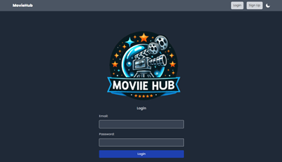
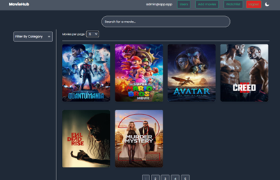
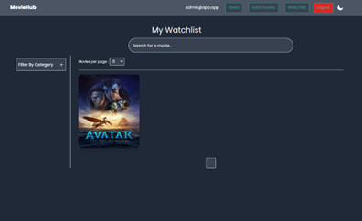
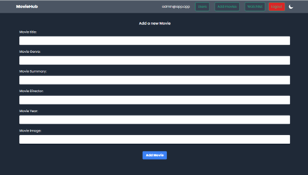
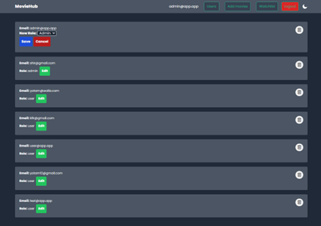

# 🎬 MovieHub – Full Stack Movie Library

Welcome to **MovieHub**, your ultimate online movie library!  
This full-stack web application allows users to explore a wide range of movies, build a personal watchlist, and enjoy a sleek user interface – all while administrators can manage content and users efficiently.

## 🌐 Live Demo
- 🔗 [Live Website](https://movie-hub-full-client.vercel.app)
- 🔗 [GitHub Repo](https://github.com/nchmoka/MovieHub-FullStack-App)

# Credentials:

## Regular User

| User         | Password |
| ------------ | -------- |
| user@app.app | 123456   |

## Admin User

| User          | Password |
| ------------- | -------- |
| admin@app.app | 123456   |

---

## 🚀 Features

### 🧑‍💻 User Functionality
- **Sign up & Log in** with email + password (secure authentication)
- **Browse movies** by category or title
- **Add to WatchList** and manage your personal movie collection
- **Responsive UI** supporting light/dark mode
- **Pagination** for large movie libraries

### 🛠 Admin Functionality
- All user features, plus:
- **Add / Delete movies**
- **Manage users** – promote/demote or delete accounts

---

## 🖼️ Screenshots

### Login Screen


### Home Page


### WatchList


### Add Movies (Admin)


### User Management (Admin)


> All screens support Light and Dark modes.

---

## 🧰 Tech Stack

| Layer      | Technology Used |
|------------|-----------------|
| Frontend   | React, Tailwind CSS, Axios |
| Backend    | Node.js, Express.js |
| Database   | MongoDB (via Mongoose) |
| Auth       | JWT + bcrypt |
| Deployment | Vercel (Frontend), Render (Backend), MongoDB Atlas (DB) |

---

## 📦 Folder Structure

```bash
MovieHub-FullStack-App/
├── backend/
│   ├── models/
│   ├── routes/
│   ├── controllers/
│   └── server.js
├── frontend/
│   ├── components/
│   ├── pages/
│   └── App.jsx
```

---

## 📌 Functional Highlights

- 🔒 **Secure Passwords** using `bcrypt` hash
- 📄 **JWT Authentication**
- 🔎 **Dynamic search** and advanced filtering
- 🔃 **Responsive layout** with Tailwind CSS
- 📚 **Modular codebase** for scalability

---

## 🧪 API & Architecture

The system is organized by MVC architecture with RESTful APIs:
- `movieController.js` – CRUD for movies
- `userController.js` – handles auth, signup/login
- `watchlistController.js` – manages personal watchlists
- `requireRole.js` – restricts admin-only routes

---

## 🙋 Team

Developed by Group 15:
- Yotam Aharon
- Matan Nachmoka
- Shirel Goldenberg
- Aviv Ben Ezra

---

## 📎 External Links

- 🌐 [MoreThanWallet App](https://www.morethanwallet.com/app/704)
- ⚙️ [Render (Backend)](https://moviehub-fullstack-app.onrender.com/login)

---

> © 2025 MovieHub – Built with passion for movies and code 🎥
